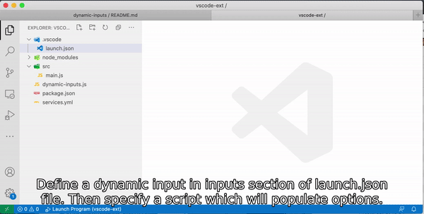

# [Dynamic Inputs (Visual Studio Code)](https://marketplace.visualstudio.com/items?itemName=igrek8.dynamic-inputs)

This extension lets you populate a dynamic list of options from which you can pick a value during debugging or running tasks.

## Features

- Supports multi value selection
- Supports other script languages (bash, python, nodejs etc.)
- Supports memoization of the parameter using `var` parameter in `args` and `dynamic-inputs.read` command
- Supports remap options to values by using `unwrap`

## Commands

- `dynamic-inputs.read` - attempts to read from memory or shows a selection list
- `dynamic-inputs.write` - always offers to a selection and saves the selection to the memory if `args.var` is given

## Demo



## Setup

1. [Create a script which populates options by writing JSON array to stdout](./playground/populate.sh)
2. [Create a script for debugging](./playground/main.js)
3. [Run a task with a dynamic variable](./playground/.vscode/tasks.json)
4. [Debug the script with a dynamic variable](./playground/.vscode/launch.json)

## Variables

[Supported variables in interpolation](./src/extension.ts#L83-L86)

## Map options to values

Given

```json
[
  { "label": "$(notebook-state-success) A", "value": "A", "picked": true },
  { "label": "$(notebook-state-error) B", "value": "B" },
  { "label": "$(notifications-configure) C", "value": "C" }
]
```

To receive `["A", "B"]` as your selection, you can use the following [JSON path expression](https://www.npmjs.com/package/jsonpath) `$[*].value`

## Playground

```bash
git clone https://github.com/igrek8/dynamic-inputs
code dynamic-inputs/playground
```

## Credits

Icons made by [Freepik](https://www.freepik.com) from [www.flaticon.com](https://www.flaticon.com/)
