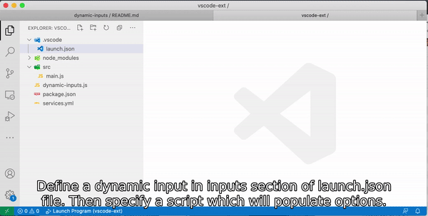

# vscode dynamic inputs

## Use case

For example, you want to pick a value from a list of dynamic options. Visual Studio Code does not support dynamic inputs in launch.json. Therefore, dynamic options are not possible. Here is the extension to save you!

## Demo



## Installation

```
curl https://github.com/igrek8/dynamic-inputs/raw/build/dynamic-inputs-0.0.1.vsix -L --output dynamic-inputs-0.0.1.vsix
code --install-extension dynamic-inputs-0.0.1.vsix
```

## How to use

1. Define your launch.json using `dynamic-inputs.require`
2. Reference the input in the launch task
3. Implement a dynamic options provider which will populate options (should be CommonJS module which exports an async function by default)

## Working example

A working sample can be found [here](./sample)

## Limitation

A script that populates options is expected to be a NodeJS script. However, one can wrap any other executable by using [child_process.execSync(command[, options])](https://nodejs.org/api/child_process.html#child_process_child_process_execsync_command_options)
